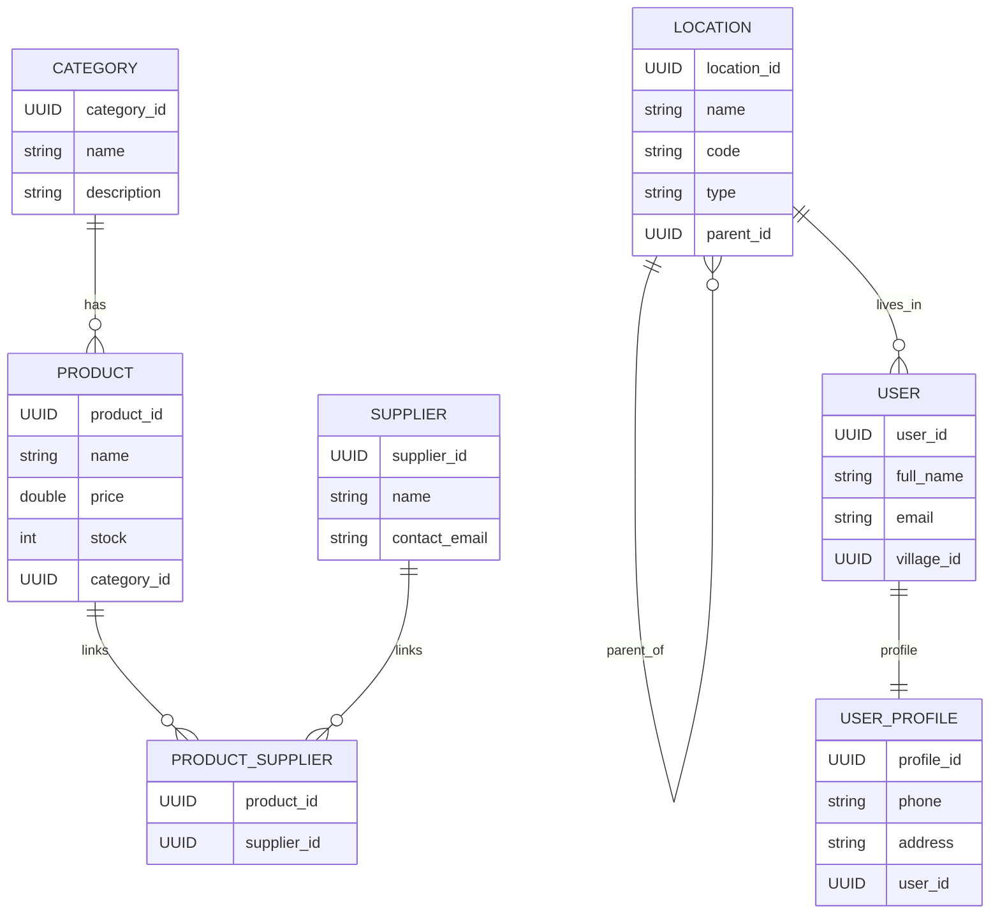

# Supermarket Spring Boot API

## Overview
This project is a Spring Boot + PostgreSQL API for a supermarket domain. It was built as a practical examination for Database & Spring Boot Application Development (February 20, 2026). The implementation follows the exam rubric and demonstrates core entity relationships, CRUD operations, existence checks, and query logic for locations and users.

## Exam Requirements Mapping
- ERD with at least five tables: implemented with `users`, `user_profiles`, `locations`, `categories`, `products`, and `suppliers`, plus join table `product_suppliers`.
- Save Location: locations are stored with hierarchical parent linkage and type validation.
- Sorting and Pagination: implemented for products using Spring Data `PageRequest` and `Sort`.
- Many-to-Many: products and suppliers via `product_suppliers`.
- One-to-Many: category to products, and location to child locations via self-reference.
- One-to-One: user to user_profile.
- `existsBy(...)` methods: used to prevent duplicates for location code, product name, category name, supplier email, user email, and user profile.
- Retrieve users by province code or name: query joins through the location hierarchy from village up to province.

## Data Model
- `Location` is hierarchical with `parent` and `type` (`PROVINCE`, `DISTRICT`, `SECTOR`, `CELL`, `VILLAGE`).
- `User` belongs to a `village` (location of type `VILLAGE`).
- `UserProfile` is a one-to-one extension of `User`.
- `Product` belongs to one `Category` and can have many `Suppliers`.

## ERD Diagram


## API Endpoints
Base URL: `http://localhost:8080`

Locations
- `POST /api/locations/save` save a location (optional `parentId` for non-province types).
- `GET /api/locations/all` list all locations.
- `GET /api/locations/users-by-province` find users by `provinceCode` or `provinceName`.

Users
- `POST /api/users/save` save a user (requires `villageCode` or `villageName`).
- `GET /api/users/all` list all users.
- `GET /api/users/search` search users by partial `fullName`.

User Profiles
- `POST /api/profiles/save` save a profile for a user (`userId`).

Categories
- `POST /api/categories/save` save a category.
- `GET /api/categories/all` list all categories.

Suppliers
- `POST /api/suppliers/save` save a supplier.
- `GET /api/suppliers/all` list all suppliers.

Products
- `POST /api/products/save` save a product (requires `categoryId`, optional `supplierIds`).
- `GET /api/products/all` list all products.
- `GET /api/products/paginated` get products with `page` and `size`.
- `GET /api/products/sorted` get products with `page`, `size`, and `sortBy`.
- `GET /api/products/by-category` list products by `categoryId`.

## Key Logic Notes
- Location save enforces a parent for any non-province location and prevents duplicate codes.
- User save resolves the village by code or name and prevents duplicate emails.
- Product save validates the category and links multiple suppliers if provided.
- Pagination and sorting are implemented with Spring Data `PageRequest` and `Sort`.
- Province-based user retrieval walks the location chain: `village -> cell -> sector -> district -> province`.

## Running The Project
1. Ensure PostgreSQL is running and a database named `supermarket_db` exists.
2. Update credentials in `src/main/resources/application.properties` if needed.
3. Start the app:

```bash
./mvnw spring-boot:run
```

## Screenshots

### Postman

#### saving a province in postman


#### saving district in postman


#### saving sector in postman


#### saving cell in postman


#### saving village in postman


#### get all locations in postman


#### saving category in postman


#### saving supplier in postman


#### saving product in postman


#### getting product with pagination in postman


#### sorting by price in postman


#### saving user in postman


#### getting user in postman


#### saving userprofile in postman


### Postgres

#### data base tables in postgre


#### province in postgres

